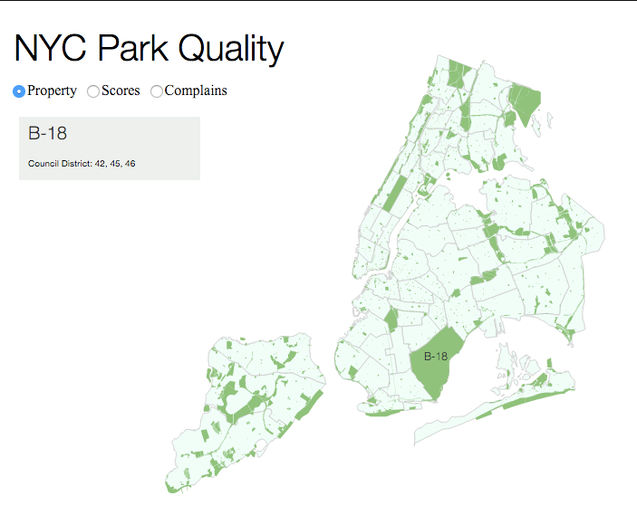

Parqa_tool
==========
**geoVis for Parqa project**

this is an attempt to visualise Parks attendance Database
as some sort of analytical tool for NYC DPR PIP.

*Current state snapshot*

##WISHES (this will be removed lately)

- nice and fast background with park_districts layout
- infopanel on howering
- filtering/serching for properties
- show list of all amenities, recent grades, area and assets coefficients
- show timeseries on selected district and/or park
- time-filtering
- quality-based color ramp
/// TBD

##TODO

- [x] basic district visualisation
- [x] District id as hover-window
- [x] District card on hover/select
	- [x] show card
	- [ ] add data (population, area, park area, tbd)
- [x] mode radiobutton
- [x] draw parks
- [x] css to separate file
- [x] js to separate file
- [x] districts over parks
- [ ] switch to modes
- [ ] choropleth
- [ ] timelines
- [ ] selection

- [ ] draw other properties
	- [ ] draw playgrounds
	- [ ] draw ps playgrounds (need to dedupe?)
	- [ ] draw beaches
	- [ ] draw pools
	- [ ] label design (?)
- [ ] optimize parks (remove small ones/convert to points)
- [ ] filters (years, type, borough)

##LastTODO
- [ ] move district labels to improve visibility
- [ ] create additional selector hotspots

##Known Bugs
- [x] for now parks are above districts: therefore, it's fruitless to hover over the park

##LINKS

- [cubism](http://bl.ocks.org/bae25/10797393)
- [mapbox mapGL](https://github.com/mapbox/mapbox-gl-js)
- [cartodb.js](http://docs.cartodb.com/cartodb-platform/cartodb-js.html)
- [d3.js](http://d3js.org/)
