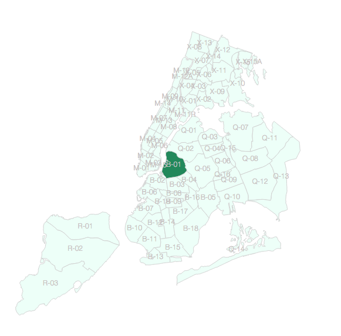

Parqa_tool
==========
**geoVis for Parqa project**

current state snapshot

this is an attempt on visualising Parks attendance Database 
for NYC DPR PIP. As it merely first try, we don't yet know what
we gonna do with it.

##LINKS

- [mapbox mapGL](https://github.com/mapbox/mapbox-gl-js)
- [cartodb.js](http://docs.cartodb.com/cartodb-platform/cartodb-js.html)
- [d3.js](http://d3js.org/)

##WISHES (this will be removed lately)

- nice and fast background with park_districts layout
- infopanel on howering
- filtering/serching for properties
- show list of all amenities, recent grades, area and assets coefficients
- show timeseries on selected district and/or park
- time-filtering
- quality-based color ramp
/// to be rethinked

##TODO

- [X] basic district visualisation
- [ ] District id as hover-window
- [ ] draw parks
- [ ] draw other proprties
	- [ ] draw playgrounds
	- [ ] draw ps playgrounds (need to dedupe?)
	- [ ] draw beaches
	- [ ] draw pools
- [ ] basic district info-window
- [ ] timeseries (?)
- [ ] tbd/brainstorm
